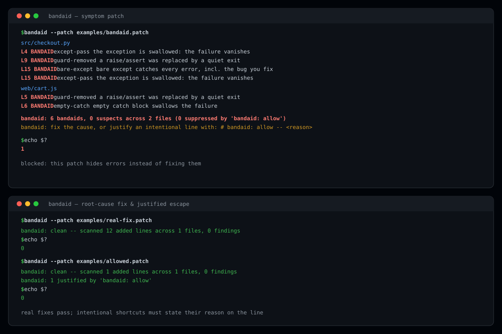

# bandaid

**Catch symptom-suppression patches before they land.** `bandaid` scans the lines your diff *adds* and rejects fixes that make the error disappear instead of removing its cause — swallowed exceptions, deleted guards, disabled tests, silenced checkers, red CI turned green by decree.


## The problem

Every codebase — and every AI coding session — accumulates patches like this:

```diff
-    raise ValueError("total must be positive")
+    return None
```

The error is gone. The bug is not. The failure now travels silently through your system as `None`, and the next person to debug it starts from scratch. This is a **bandaid**: the symptom was hidden, the cause untouched.

AI agents produce bandaids at scale, because "make the test pass" is optimizable by deleting the thing that reports failure. `bandaid` is the gate that says: *no*.

## How it works

`bandaid` reads a unified diff (working tree, staged, a branch, a patch file, or stdin) and inspects **only added lines** — your old code is not the change. Three rule families:

| Family | What it does | Example rule |
| --- | --- | --- |
| **Line rules** | pattern match on a single added line | `except:` on its own line |
| **Adjacency rules** | head line + next added line must have consecutive line numbers | `except ...:` followed by `pass` |
| **Pairing rules** | removed lines vs. added lines **within the same hunk** | a deleted `raise` reappearing as a quiet `return` |

The pairing rules are the ones single-line linters cannot write: they catch the fix that quietly deletes the guard which surfaced the bug — no added line looks wrong in isolation.

Two severities:

- **bandaid** — the error is being hidden. Fails the scan (exit 1).
- **suspect** — smells like a shortcut, may be legitimate. Passes by default; fails with `--strict`.

Full catalogue with every pattern: [references/RULES.md](references/RULES.md).

## Install

```bash
git clone https://github.com/F0Rextasy/bandaid.git
# requires python 3.8+ and git, nothing else
alias bandaid='python /path/to/bandaid/scripts/bandaid.py'
```

Or drop the script anywhere on your `PATH`. No dependencies, no config file.

### As an Agent Skill

`bandaid` ships a [SKILL.md](SKILL.md) that teaches an AI coding agent to reproduce the bug before editing, fix at the cause, and gate its own diff:

```bash
# Claude Code / compatible clients
cp -r bandaid ~/.claude/skills/bandaid
# or per-project
cp -r bandaid .claude/skills/bandaid
```

Once installed, the agent runs `python scripts/bandaid.py` on its own diff before reporting success — and refuses to claim "fixed" over a non-zero exit.

## Usage

```bash
bandaid                      # git diff vs HEAD
bandaid --staged             # staged changes (pre-commit hook)
bandaid --base main          # everything on your branch (PR review)
bandaid --patch fixes.diff   # any patch file
git show HEAD | bandaid --patch -   # stdin
bandaid --strict             # also fail on suspects
bandaid --format json        # machine output for CI
```

### Exit codes

| Code | Meaning |
| --- | --- |
| `0` | clean |
| `1` | bandaids found — do not merge, do not report success |
| `2` | usage error (git missing, no commits yet, unreadable patch) |

### Escape hatch

A shortcut you actually mean must justify itself on the added line:

```python
except LegacyTimeout:  # bandaid: allow -- upstream issue #42, remove after v3
    pass  # upstream SDK no-ops here until v3
```

The comment is stripped before matching — the rule still sees what you wrote — and the finding is counted as justified, never silently dropped. A bare `bandaid: allow` without a reason still shows up in the summary.

### CI (GitHub Actions)

```yaml
- name: reject symptom patches
  run: |
    git fetch origin main
    python scripts/bandaid.py --base origin/main --strict
```

## Evidence

Run from this repository (`python -m unittest discover -s tests -v`):

```
test_clean_scan_never_crashes ... ok
test_json_reports_structure ... ok
test_justified_escape_passes_and_counts ... ok
test_root_cause_fix_is_clean ... ok
test_suspect_passes_by_default_and_fails_strict ... ok
test_symptom_patch_fails_with_named_rules ... ok

----------------------------------------------------------------------
Ran 6 tests in 0.557s

OK
```

The suite drives the real CLI against the fixture patches in [`examples/`](examples/) and asserts exit codes and reported findings — nothing internal:

| Fixture | What it is | Expected | Observed |
| --- | --- | --- | --- |
| [`bandaid.patch`](examples/bandaid.patch) | 6-way symptom patch (swallow, delete guard, empty catch) | exit 1, 6 bandaids | exit 1, 6 bandaids |
| [`real-fix.patch`](examples/real-fix.patch) | same bugs, fixed at the cause | exit 0, clean | exit 0, clean |
| [`allowed.patch`](examples/allowed.patch) | intentional shortcut with `bandaid: allow` | exit 0, 1 justified | exit 0, 1 justified |
| `--format json` | machine output | `ok:false`, `bandaid:6` | `ok:false`, `bandaid:6` |

Symptom patch, caught — real output:

```
src/checkout.py
  L4    BANDAID except-pass       the exception is swallowed: the failure vanishes without being handled
  L9    BANDAID guard-removed     a raise/assert that surfaced this bug was replaced by a quiet exit
  L15   BANDAID bare-except       bare except catches every error, including the bug you are fixing
  L15   BANDAID except-pass       the exception is swallowed: the failure vanishes without being handled

web/cart.js
  L5    BANDAID guard-removed     a raise/assert that surfaced this bug was replaced by a quiet exit
  L6    BANDAID empty-catch       empty catch block swallows the failure

bandaid: 6 bandaids, 0 suspects across 2 files (0 suppressed by 'bandaid: allow')
bandaid: fix the cause, or justify an intentional line with:  # bandaid: allow -- <reason>
$ echo $?
1
```

Same bugs fixed at the cause — same scanner, clean:

```
$ bandaid --patch examples/real-fix.patch
bandaid: clean -- scanned 12 added lines across 1 files, 0 findings
$ echo $?
0
```

## Design notes

- **Added lines only.** Old code is context, not the change. Reducing the scan surface keeps false positives near zero.
- **Escape before match, count always.** `bandaid: allow` suppresses the finding but increments a visible counter — justified shortcuts are auditable.
- **Conservative pairing.** If the added lines still contain a `raise`/`assert`/`throw` (the fix re-established its guard), `guard-removed` stands down. Real fixes must pass clean, or the gate becomes noise.
- **Two severities, one knob.** Suspects don't block CI until you opt in with `--strict` — teams adopt the strict gate after the bandaid gate proves itself.

## Project layout

```
bandaid/
├── SKILL.md               # Agent Skill: reproduce → isolate → fix → verify → gate
├── scripts/bandaid.py     # the scanner (single file, stdlib only)
├── references/RULES.md     # full rule catalogue with patterns and examples
├── examples/               # fixture patches: symptom, real fix, justified
└── tests/test_bandaid.py   # contract tests driving the real CLI
```

## License

[MIT](LICENSE)
