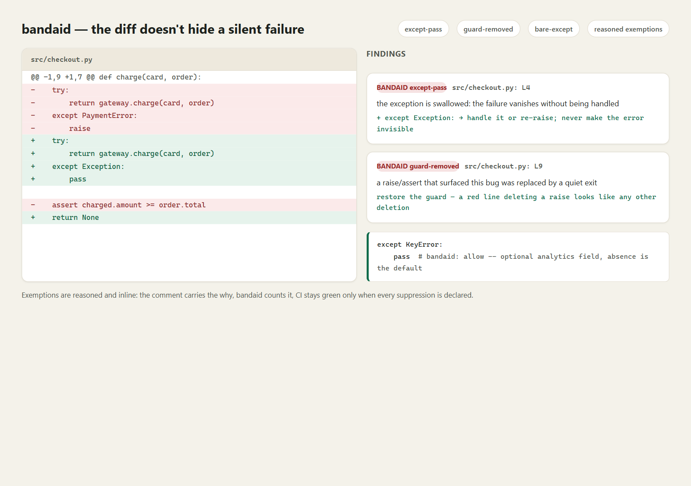
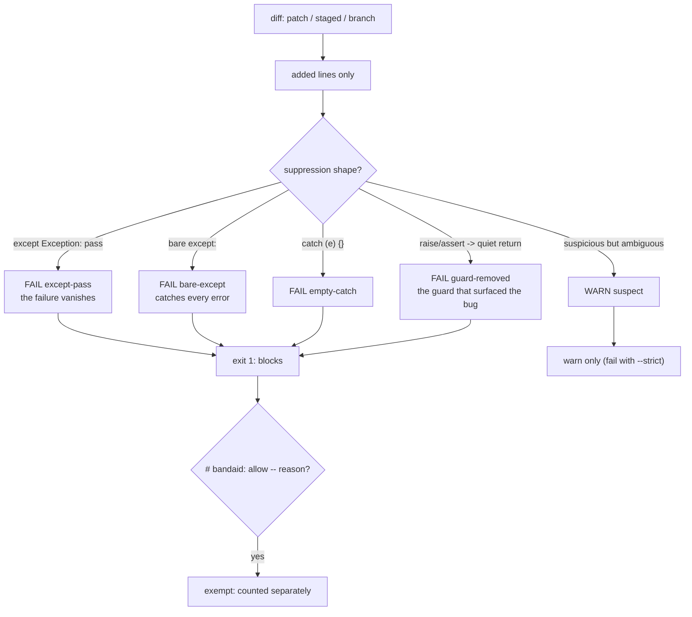

# bandaid

**Catch symptom-suppression patches in the diff.** Swallowed exceptions, disabled tests, removed raise/assert guards, empty catches - the "fix" that makes the failure disappear instead of fixing what caused it. One command over a patch, staged changes, or a branch: milliseconds, offline, exit 1 while the bandaid is still uncommitted.

[](https://github.com/F0Rextasy/bandaid/actions/workflows/test.yml)
[](https://www.python.org/)
[](https://skills.sh/F0Rextasy/bandaid)
[](LICENSE)



## Why this exists

The flaky checkout bug was "fixed" by wrapping the payment call in `except Exception: pass`. The failing assertion was "fixed" by deleting the assertion. The failing test was "fixed" with `@skip`. Every one of those diffs reduces failure *visibility* while leaving failure *cause* untouched - and code review is where they slip through, because a red line deleting a `raise` looks like any other deletion. `bandaid` reads diffs the way a reviewer wishes they could: it flags the specific shapes of suppression, cites the line, and tells you what to do instead.

## Quick start

```bash
# install the skill into any agent (Claude Code, Codex, Cursor, OpenCode, ...):
npx skills add F0Rextasy/bandaid

# or run it directly:
git clone https://github.com/F0Rextasy/bandaid
cd myproject
python /path/to/bandaid/scripts/bandaid.py --staged          # pre-commit
python /path/to/bandaid/scripts/bandaid.py --base origin/main # branch diff
python /path/to/bandaid/scripts/bandaid.py --patch fix.patch   # a patch file
```

| Exit | Meaning |
| --- | --- |
| `0` | no suppression patterns (warnings allowed unless `--strict`) |
| `1` | bandaid found (or `--strict` suspect) |
| `2` | usage error |

`--format json` for machines; `--patch -` reads the diff from stdin.

## How it decides



Full rule catalogue with severity and exemptions: [references/RULES.md](references/RULES.md).

## What it catches (real output)

```console
$ python scripts/bandaid.py --patch examples/bandaid.patch --no-color
src/checkout.py
  L4    BANDAID except-pass       the exception is swallowed: the failure vanishes without being handled
         + except Exception:
         -> handle it or re-raise; never make the error invisible
  L9    BANDAID guard-removed     a raise/assert that surfaced this bug was replaced by a quiet exit
         + return None
         -> keep the guard; fix whatever violated it

web/cart.js
  L5    BANDAID guard-removed     a raise/assert that surfaced this bug was replaced by a quiet exit
         + return apply(cart);
         -> keep the guard; fix whatever violated it
  L6    BANDAID empty-catch       empty catch block swallows the failure
         + } catch (e) {}
         -> log with the cause and rethrow

bandaid: 6 bandaids, 0 suspects across 2 files (0 suppressed by 'bandaid: allow')
bandaid: fix the cause, or justify an intentional line with:  # bandaid: allow -- <reason>
[exit 1]
```

Every finding shows the offending added line and the replacement advice. A genuinely intentional swallow travels with a reason:

```python
except KeyError:
    pass  # bandaid: allow -- optional analytics field, absence is the default
```

## Wire it into CI

```yaml
- uses: actions/checkout@v4
  with:
    fetch-depth: 0
- name: no bandaids on this branch
  run: python bandaid/scripts/bandaid.py --base origin/${{ github.base_ref }} --strict
```

Or pre-commit: `python bandaid.py --staged` before every `git commit`.

## What it will never do

- Flag a *raise* or a *test assertion being added* - only suppressions appearing in the diff.
- Rewrite your code - it cites the line and names the fix; the fix is yours.
- Fail on a justified case: `# bandaid: allow -- <reason>` exempts one line, recorded in the summary.

## One path, many gates — the family

Deterministic gates - one Python script each, stdlib, same exit contract:

| Repo | What its verdict means |
| --- | ---|
| [dsh-gate](https://github.com/F0Rextasy/dsh-gate) | the shell session actually ran - real commands, real files, real log |
| [sessionaudit](https://github.com/F0Rextasy/sessionaudit) | the session behaved - scope, secrets, destructive acts, self-contradicted claims |
| [cigate](https://github.com/F0Rextasy/cigate) | the workflows burn each minute once - pins, path filters, dedup, budget |
| [ci-triage](https://github.com/F0Rextasy/ci-triage) | one log, one verdict: regression / flaky / infra / pass |
| [docproof](https://github.com/F0Rextasy/docproof) | every README doc snippet is runnable, parsed, and verified in CI |
| [preflight](https://github.com/F0Rextasy/preflight) | the config is safe to ship - semantics, not syntax |
| [prove-it](https://github.com/F0Rextasy/prove-it) | every claim in this README is backed by real, captured output |
| [shipcheck](https://github.com/F0Rextasy/shipcheck) | the artifacts in `dist/` match `src/` - nothing stale ships |
| [testgate](https://github.com/F0Rextasy/testgate) | the tests that ran are the tests that exist - gaps, dupes, skips |
| [bandaid](https://github.com/F0Rextasy/bandaid) | the diff doesn't hide a silent failure - swallowed errors, dead guards |
| [wincompat](https://github.com/F0Rextasy/wincompat) | every path in the tree survives a Windows checkout |
| [compressproof](https://github.com/F0Rextasy/compressproof) | the context shrank without losing an answer - reversible compression, byte proof, answer-equivalence oracle |
| [uigate](https://github.com/F0Rextasy/uigate) | the UI stops looking like the same AI slop - measurable design-slop lint, WCAG + template tells |
| [aitell](https://github.com/F0Rextasy/aitell) | the prose stops reading as AI - deterministic AI-tell detection with a published confusion matrix |
| [route-drift](https://github.com/F0Rextasy/route-drift) | OpenAPI spec vs code routes drift gate |

## License

[MIT](LICENSE)
